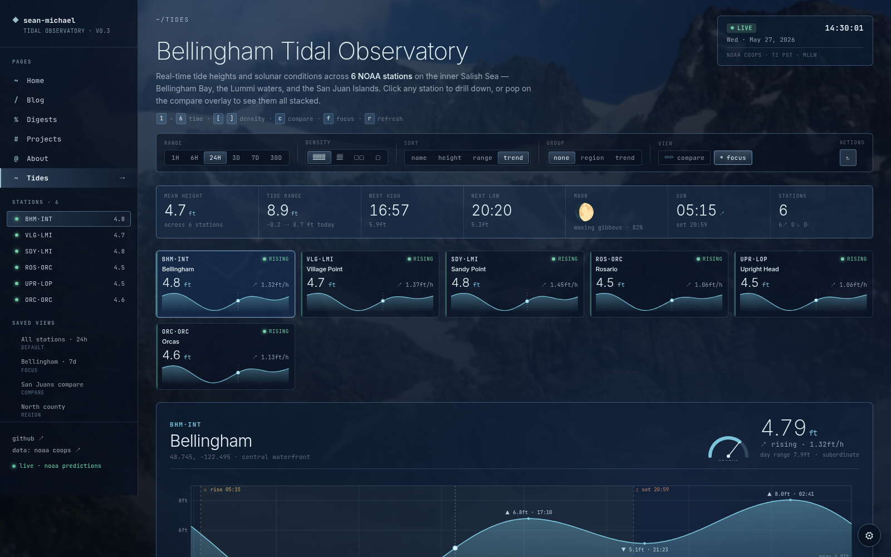
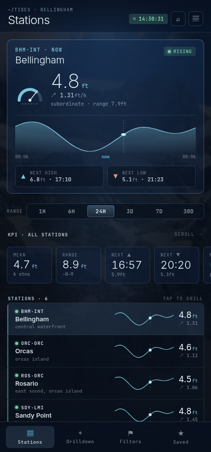
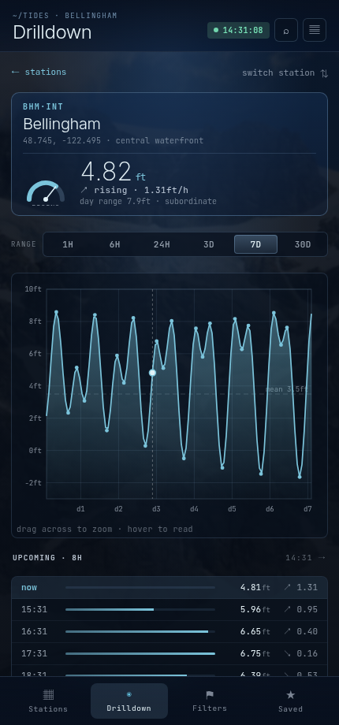

# Bellingham Tidal Observatory (BTO)

Tide dashboard for the inner Salish Sea. It pulls real high/low predictions from
the [NOAA CO-OPS API](https://api.tidesandcurrents.noaa.gov/api/prod/) for six
stations around Bellingham Bay and the San Juans, draws a smooth curve between
them, and lays it all out like an old-school ops dashboard — a grid of stations,
a focus drilldown you can drag to zoom, time ranges from an hour to a month, and
sun/moon overlays.

Live at **[sean-michael.dev/tides](https://sean-michael.dev/tides)**.



It works on a phone too — the grid collapses into a single-column app with a
tap-through drilldown:

<p>
  
  
</p>

## Stack

- **Backend** (`backend/`) — FastAPI on `uv`, wrapping the `noaa_coops` client.
- **Frontend** (`frontend/`) — React + TypeScript + Vite.

## Run it

With Docker Compose (both services, hot-reload):

```bash
docker compose up --build      # UI on :5173, API on :8000
```

Or run the two halves yourself:

```bash
cd backend && uv run uvicorn app.main:app --reload      # :8000
cd frontend && npm install && npm run dev               # :5173, proxies /api
```

For a single production container — frontend built and served as static files by
FastAPI:

```bash
docker build -t bto . && docker run -p 8000:8000 bto    # :8000
```

## How it works

NOAA only publishes high/low events for these stations (most are subordinate —
their predictions are offsets from a reference station, not a continuous curve).
So the backend fetches the real hi/lo points and interpolates a half-cosine
between them, which is what the tide actually does between a high and a low. The
numbers at the peaks and troughs are NOAA's; the line connecting them is the
interpolation.

Sun and moon times come from `astral`. NOAA's feed has no weather or solunar
data, so the drilldown shows real sun/moon and station info instead of making
anything up.

The whole bootstrap (six stations + sun/moon) is one request; the frontend does
the curve math client-side, so changing range or hovering never hits the network.

## Configuration

Backend settings live in `backend/.env`, all prefixed `BTO_` (see
`backend/.env.example`):

| Variable           | Description                                       |
| ------------------ | ------------------------------------------------- |
| `BTO_STATIC_DIR`   | Path to the built frontend; serves the UI when set. |
| `BTO_CORS_ORIGINS` | Allowed CORS origins (JSON list).                 |
| `BTO_CACHE_TTL`    | Seconds to cache NOAA responses in memory.        |

## Stations

| Name                              | ID      | Lat      | Lon       | Predictions |
| --------------------------------- | ------- | -------- | --------- | ----------- |
| Bellingham                        | 9449211 | +48.7450 | -122.4950 | Subordinate |
| Village Point, Lummi Island       | 9449161 | +48.7167 | -122.7080 | Harmonic    |
| Sandy Point, Lummi Bay            | 9449292 | +48.7900 | -122.7080 | Subordinate |
| Rosario, East Sound, Orcas Island | 9449771 | +48.6467 | -122.8700 | Harmonic    |
| Upright Head, Lopez Island        | 9449911 | +48.5717 | -122.8850 | Harmonic    |
| Orcas, Orcas Island               | 9449798 | +48.6000 | -122.9500 | Subordinate |

### Notes

[This reddit post](https://www.reddit.com/r/oceanography/comments/i0e8m5/calculation_of_subordinate_tide_stations_from/)
was helpful for understanding the Subordinate/Harmonic distinction. The Bellingham
station is interpolated from readings at Port Townsend, and the curves get drawn
as Bézier-ish curves between the highs and lows — which took me right back to
Intro to Computer Graphics at OSU. Would've made a great assignment.
